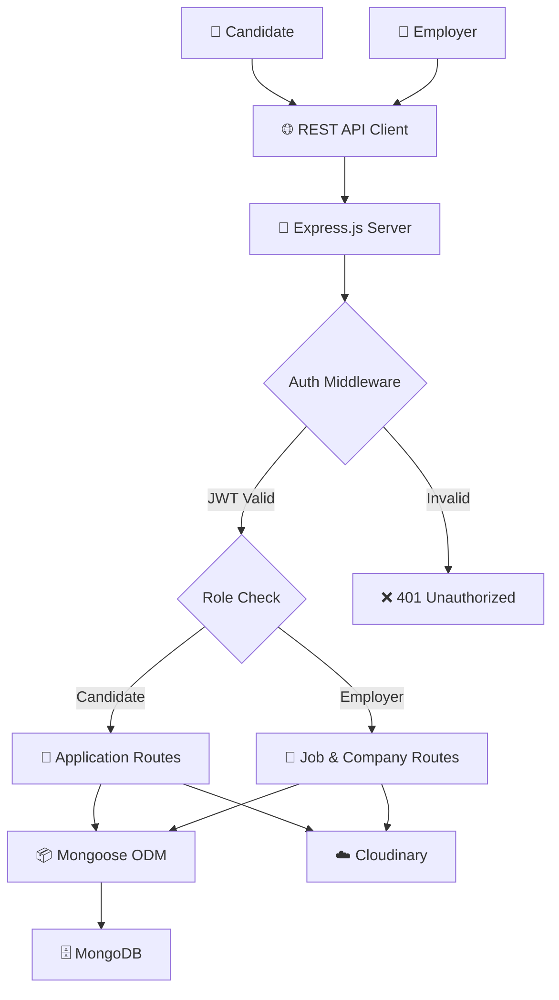

<div align="center">

# 💼 Job Portal SaaS

**A full-stack hiring platform — employers post jobs, candidates apply, all managed through role-based dashboards**


</div>

---

## 📑 Table of Contents

- [Overview](#-overview)
- [Features](#-features)
- [Tech Stack](#-tech-stack)
- [Project Structure](#-project-structure)
- [Architecture](#-architecture)
- [API Endpoints](#-api-endpoints)
- [Security](#-security)
- [File Uploads](#-file-uploads)
- [Getting Started](#-getting-started)
- [Concepts Covered](#-concepts-covered)
- [Future Improvements](#-future-improvements)
- [Author](#-author)

---

## 📖 Overview

**Job Portal SaaS** is a full-stack hiring platform that allows **employers** to manage companies, post jobs, and review applications — while enabling **candidates** to search for jobs, upload resumes, and apply seamlessly.

Built with the **MERN Stack** and **Cloudinary** for cloud-based file management. Features role-based authorization, password reset flow, search and filtering, and separate employer and candidate dashboards.

---

## ✨ Features

### 🔐 Authentication

| Feature | Description |
|---|---|
| 📝 Registration & Login | Secure account creation with hashed passwords |
| 🎫 JWT Auth | Stateless token-based session management |
| 🛡️ Protected Routes | Middleware guards for authenticated access |
| 👥 Role-Based Authorization | Separate permissions for Candidates and Employers |
| 🔑 Forgot Password | Initiate password reset flow via email |
| 🔄 Reset Password | Token-validated password update |

---

### 👤 Candidate Features

| Feature | Description |
|---|---|
| 👁️ View & Update Profile | Manage personal info and profile picture |
| 📄 Upload Resume | Store resume on Cloudinary |
| 🔍 Search & Filter Jobs | Find relevant jobs by keyword, type, or location |
| 📃 Pagination | Paginated job listings for performance |
| 📨 Apply for Jobs | Submit applications with one click |
| 📋 View Applications | Track all submitted applications |
| ↩️ Withdraw Application | Withdraw when application allows it |
| 📊 Candidate Dashboard | Summary of all application statuses |

---

### 🏢 Employer Features

| Feature | Description |
|---|---|
| 🏗️ Create / Update / Delete Company | Manage company profiles with logo upload |
| 📢 Post / Update / Close / Delete Jobs | Full job lifecycle management |
| 📬 View Applications | Review all applications per job |
| 🔄 Update Application Status | Accept, reject, or move candidates forward |
| 📊 Employer Dashboard | Stats on companies, jobs, and applications |

---

### 📊 Dashboard Metrics

| Employer Dashboard | Candidate Dashboard |
|---|---|
| Total Companies | Total Applications |
| Total Jobs | Application Status Summary |
| Open / Closed Jobs | — |
| Total Applications | — |
| Application Statistics | — |

---

## 🛠 Tech Stack

| Layer | Technologies |
|---|---|
| **Backend** | Node.js, Express.js |
| **Database** | MongoDB, Mongoose |
| **Authentication** | JWT, bcryptjs |
| **File Uploads** | Multer, Cloudinary |
| **Environment** | dotenv |
| **API Testing** | Postman |

---

## 📁 Project Structure

```bash
Job-Portal/
│
├── config/
│   ├── db.js                   # MongoDB connection
│   └── cloudinary.js           # Cloudinary configuration
│
├── controllers/                # Route handler logic (auth, users, companies, jobs, applications)
│
├── middleware/
│   ├── protect.js              # JWT auth middleware
│   └── uploadFactory.js        # Multer + Cloudinary upload factory
│
├── models/                     # Mongoose schemas (User, Company, Job, Application)
│
├── routes/                     # Express route definitions per module
│
├── utils/                      # Helper utilities (email, token, error handling)
│
├── server.js
├── .env
└── package.json
```

---

## 🏗 Architecture



---

## 📡 API Endpoints

### Authentication

| Method | Endpoint | Access | Description |
|---|---|---|---|
| `POST` | `/api/auth/register` | Public | Register a new user |
| `POST` | `/api/auth/login` | Public | Login and receive JWT |
| `POST` | `/api/auth/forgot-password` | Public | Initiate password reset |
| `PUT` | `/api/auth/reset-password/:token` | Public | Reset password with token |

### Users

| Method | Endpoint | Access | Description |
|---|---|---|---|
| `GET` | `/api/users/profile` | Protected | Get current user profile |
| `PUT` | `/api/users/profile` | Protected | Update profile details |
| `PUT` | `/api/users/profile/picture` | Protected | Upload profile picture |

### Companies

| Method | Endpoint | Access | Description |
|---|---|---|---|
| `POST` | `/api/companies` | Employer | Create a new company |
| `GET` | `/api/companies` | Protected | Get all companies |
| `PUT` | `/api/companies/:id` | Employer | Update company details |
| `DELETE` | `/api/companies/:id` | Employer | Delete a company |

### Jobs

| Method | Endpoint | Access | Description |
|---|---|---|---|
| `POST` | `/api/jobs` | Employer | Post a new job |
| `PUT` | `/api/jobs/:id` | Employer | Update job details |
| `PUT` | `/api/jobs/:id/close` | Employer | Close a job listing |
| `DELETE` | `/api/jobs/:id` | Employer | Delete a job |
| `GET` | `/api/jobs` | Public | Search / filter / paginate jobs |

### Applications

| Method | Endpoint | Access | Description |
|---|---|---|---|
| `POST` | `/api/applications/:jobId` | Candidate | Apply for a job |
| `GET` | `/api/applications/my` | Candidate | View own applications |
| `DELETE` | `/api/applications/:id` | Candidate | Withdraw an application |
| `GET` | `/api/applications/job/:jobId` | Employer | View applications per job |
| `PUT` | `/api/applications/:id/status` | Employer | Update application status |

### Dashboard

| Method | Endpoint | Access | Description |
|---|---|---|---|
| `GET` | `/api/dashboard/employer` | Employer | Employer stats and metrics |
| `GET` | `/api/dashboard/candidate` | Candidate | Candidate application summary |

---

## 🔒 Security

- JWT Authentication with expiry
- Password hashing via bcryptjs
- Protected routes via middleware
- Role-based access control (Candidate / Employer)
- Ownership validation on company and job mutations
- Sensitive keys managed via environment variables

---

## ☁️ File Uploads

All file assets are stored and managed via **Cloudinary**:

| Asset | Upload Trigger |
|---|---|
| 👤 Profile Picture | Candidate profile update |
| 📄 Resume (PDF) | Candidate resume upload |
| 🏢 Company Logo | Employer company creation / update |

Files are processed by **Multer** in-memory before being streamed to Cloudinary via the `uploadFactory` middleware.

---

## 🚀 Getting Started

### Prerequisites
- Node.js (v16+)
- MongoDB (local or Atlas)
- Cloudinary account

### Installation

```bash
# Clone the repository
git clone https://github.com/Jeevan9898/job-portal.git
cd job-portal

# Install dependencies
npm install
```

### Environment Variables

Create a `.env` file in the project root:

```env
MONGO_URI=your_mongodb_connection_string
JWT_SECRET=your_jwt_secret_key
PORT=5000
CLOUDINARY_CLOUD_NAME=your_cloudinary_cloud_name
CLOUDINARY_API_KEY=your_cloudinary_api_key
CLOUDINARY_API_SECRET=your_cloudinary_api_secret
```

### Run the Server

```bash
npm run dev
```

---

## 🎓 Concepts Covered

- REST API Development with MVC Architecture
- JWT Authentication & Role-Based Authorization
- MongoDB Aggregation & Mongoose `populate()`
- Search, Filtering & Pagination
- Cloudinary Integration & Multer File Uploads
- Password Reset Flow with token validation
- Ownership Validation Middleware
- Environment variable management
- Structured error handling

---

## 🔮 Future Improvements

- [ ] React Frontend
- [ ] Charts & Analytics
- [ ] Notifications
- [ ] Email Verification
- [ ] Redis Caching
- [ ] Docker Support
- [ ] Swagger API Documentation
- [ ] Unit Testing
- [ ] CI/CD Pipeline

---

## 👤 Author

**Jeevan Yadav**

[](https://jeevan-yadav.vercel.app/)
[](https://github.com/Jeevan9898)
